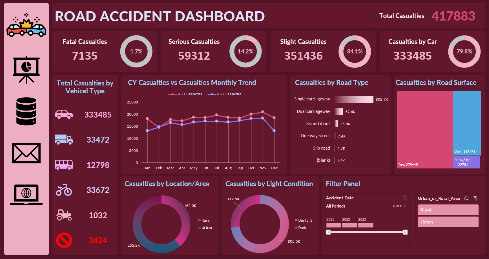

# 🚦 Road Accident Data Analysis Dashboard (Excel)

## 📌 Project Overview

This project presents a comprehensive **road accident data analysis dashboard** developed using **Microsoft Excel**.
The dashboard provides actionable insights into road traffic casualties by analyzing accident severity, vehicle types, road conditions, environmental factors, and time-based trends.

The primary objective of this project is to **transform raw accident data into meaningful visual insights** that support data-driven decision-making related to road safety and traffic management.

---

## 📊 Key Features

The dashboard includes interactive and visually intuitive components such as:

* **Total Casualties Overview**

  * Fatal casualties
  * Serious casualties
  * Slight casualties
* **Casualties by Vehicle Type**

  * Cars, trucks, buses, bicycles, agricultural vehicles, and others
* **Monthly Trend Analysis**

  * Comparison of casualties across different years
* **Casualties by Road Type**

  * Single carriageway, dual carriageway, roundabouts, slip roads, etc.
* **Casualties by Road Surface Condition**

  * Dry, wet, snowy/icy surfaces
* **Environmental Analysis**

  * Daylight vs dark conditions
  * Urban vs rural areas
* **Interactive Filters**

  * Year selection
  * Urban/Rural area filtering

---

## 🛠 Tools & Techniques Used

* **Microsoft Excel**

  * Pivot Tables
  * Pivot Charts
  * Slicers and Timelines
  * Conditional Formatting
  * Dashboard Layout Design
* **Data Cleaning & Preparation**

  * Handling missing values
  * Data categorization
  * Aggregation and transformation

---

## 🖼 Dashboard Preview

---

## 📂 Dataset Information

The dataset used in this project is based on **official road traffic accident and casualty records** and includes information such as:

* Accident severity
* Vehicle involvement
* Road type and surface condition
* Lighting conditions
* Location type (urban or rural)
* Date and time of accidents

---

## 📈 Insights & Findings

* The majority of casualties are classified as **slight injuries**, accounting for over **80%** of total cases.
* **Cars** are involved in the highest number of casualties compared to other vehicle types.
* **Single carriageway roads** contribute to the largest share of accidents.
* Most accidents occur on **dry road surfaces**, indicating driver behavior plays a significant role beyond weather conditions.
* Casualties are notably higher in **urban areas** and during **daylight hours**.

---

## 🎯 Project Purpose

This project was created to:

* Strengthen **data analysis and visualization skills using Excel**
* Demonstrate the ability to design **professional dashboards**
* Extract meaningful insights from real-world datasets
* Build a strong **data analytics portfolio project**

---

## 📬 Contact

For feedback, collaboration, or questions:

* **GitHub:** [Hadeer.Altabaa](https://github.com/HadeerAltabaa)
* **LinkedIn:** [Hadeer Altabaa](https://www.linkedin.com/in/hadeeraltabaajuniorwebdeveloper)

---
